<!-- Typing animation header -->

 

---

## About

Engineering leader with **14+ years** building and scaling platforms, cloud infrastructure, and product engineering teams in high-growth environments. Currently **Director of Engineering – Platform at Tekmetric**, partnering with the CTO on engineering strategy, budgeting, and M&A due diligence.

**Selected work**

- Scaled the engineering organization from under a dozen to **50+ engineers**, establishing the Platform and Infrastructure teams from scratch.
- Architected a **payments orchestration platform** integrating Stripe Connect and additional providers, processing billions of dollars in transactions yearly.
- Introduced security practices that deflected **large-scale DDoS attacks** against mission-critical systems.
- Leading research across **data-at-scale, ML, and LLMs**, and founded a new Python department to open additional product verticals.

I speak and write about high-performance distributed systems, platform and infrastructure engineering, and scaling engineering organizations through hypergrowth.

Based in Cluj-Napoca, Romania. Open to connecting on [LinkedIn](https://www.linkedin.com/in/bogdanmariesan).

---

## Tech Stack

**Languages**

**AI & Data**

**Frameworks & Runtimes**

**Cloud & DevOps**

**Data & Messaging**

---

## Talks & Videos

<!-- YOUTUBE-VIDEOS-LIST:START -->
- [High performance message brokers out of the IoT world](https://www.youtube.com/watch?v=hdeD4koSoBY)
<!-- YOUTUBE-VIDEOS-LIST:END -->

▶ [...more YouTube videos](https://www.youtube.com/channel/UCOGaI0WQ3a5ay0pcBCHYB1A?sub_confirmation=1)

---

## GitHub Stats

<!-- These SVGs are generated by the Metrics GitHub Action (.github/workflows/metrics.yml)
     and committed to the repo, so they never depend on a third-party live service. -->

---

## Contribution Graph

<!-- Generated by the snake GitHub Action (.github/workflows/snake.yml) -->
<picture>
  <source media="(prefers-color-scheme: dark)" srcset="https://raw.githubusercontent.com/bmariesan/bmariesan/output/github-contribution-grid-snake-dark.svg" />
  <source media="(prefers-color-scheme: light)" srcset="https://raw.githubusercontent.com/bmariesan/bmariesan/output/github-contribution-grid-snake.svg" />
  
</picture>

